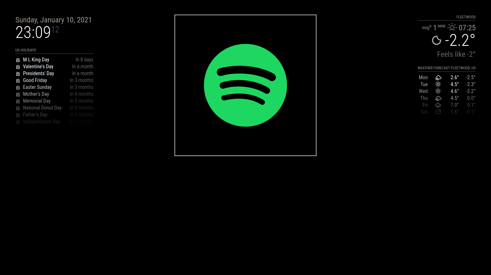
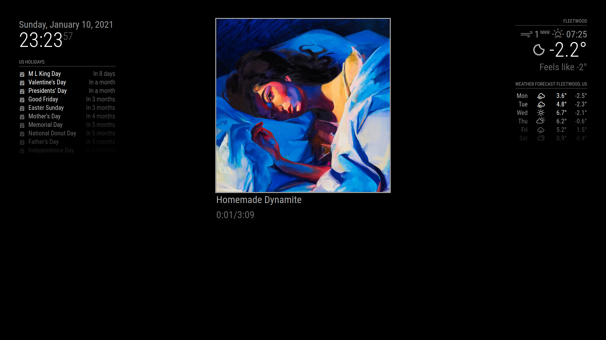

# MMM-spotifyStatus
Magic Mirror module to display currently-playing Spotify track. Requires creation of your own Spotify app at https://developer.spotify.com/ for API access.
#Setup
After creating your Spotify app, use the Authorization Code Flow to get a refresh token with scope `user-read-playback-state`.

After cloning `MMM-spotifyStatus` into your Magic Mirror `modules` folder and installing dependencies with `npm install`, enable the module in your Magic Mirror config by adding the following to your `modules` list:
```
		{
			module: "MMM-spotifyStatus",
			position: "top_center",
			config: {
				clientId: "YOUR_APP_CLIENT_ID",
				clientSecret: "YOUR_APP_CLIENT_SECRET",
				refreshToken: "YOUR_AUTHORIZATION_REFRESH_TOKEN"
			}
		}
```
Make sure to populate the three config options with your own client id, secret and token.

Upon launching Magic Mirror, you should see the following:



Upon playing a song, you'll see:



You're all set!

Future versions will include customizable module size, artist names, and support for non-music content (e.g. podcasts).
